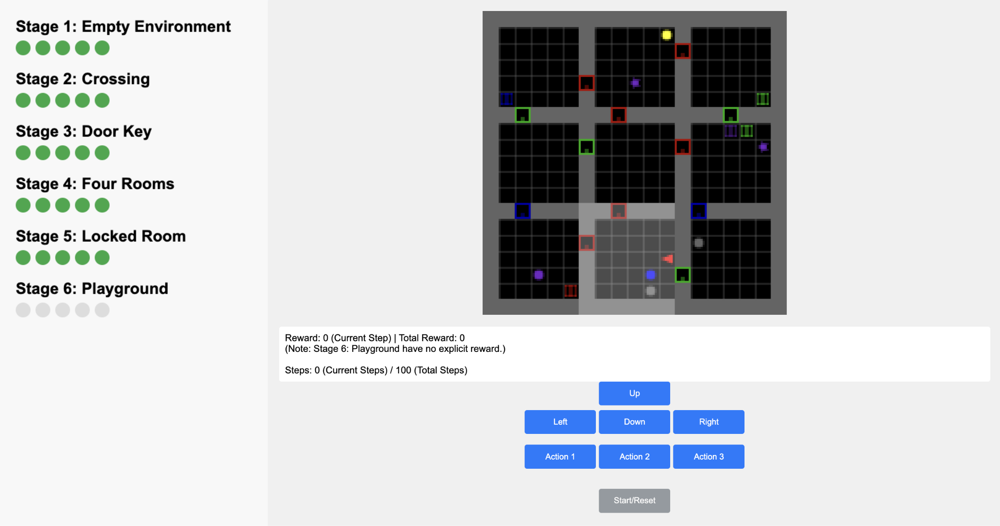

## Heterogeneous Adversarial Play in Interactive Environments  
Manjie Xu, Xinyi Yang, Jiayu Zhan, Wei Liang, Chi Zhang, Yixin Zhu

<a href='https://arxiv.org'>
  
</a>
<a href='https://sites.google.com/view/hap-learning'>
  
</a>  


This repo contains demo code for our NeurIPS paper "Heterogeneous Adversarial Play in Interactive Environments." We propose an adversarial learning framework in which a teacher module generates problems tailored to the student's current capabilities

### Install
```sh
pip install -r requirements.txt
pip install -e .
```
Optional: If manual dependency management is required:
```
# For compatibility with specific versions (if needed)
pip install setuptools==65.5.0 pip==21 wheel==0.38.0
pip install stable-baselines3==1.7.0 baselines==0.1.6 scikit-image seaborn tensorboard
cd env_folder
pip install xxx
```
### Code Structure

```bash
├── src                # Core implementation
├── envs               # Modified interactive environments (Navigation, Minigrid, CRAFT, Crafter, Pacman) 
├── replication        # Raw data for reproducing paper results and figures
├── minigrid_human_test  # Human study WebUI frontend/backend (Flask-based)   
└── requirements.txt   # Dependency list 
```
### Human Study WebUI
  

We conducted a human study as part of our paper, collecting human performance data both with and without curricula to further demonstrate the effectiveness of our proposed algorithms based on Minigrid. 

The WebUI is developed using Flask, with Python managing the backend task environments. Our interface supports multiprocess execution and can be hosted online.

```bash
cd minigrid_human_test
pip install flask_sqlalchemy flask flask_login
python app.py           # Host online (multi-user support)
```

Human behavior data is recorded in a database. You can run parse_db.py to view basic statistics.

Our human study results raw data on Minigrid: `minigrid_human_test/figs/human_study_results_hap.xlsx`

### Ack
Our code is built based on the following work:  
[Crafter](https://github.com/danijar/crafter)  
[Minigrid](https://github.com/Farama-Foundation/gym-minigrid)  
[rl-plotter](https://github.com/ncullen93/rl-plotter)  
[flask](https://flask.palletsprojects.com/)  
[stable-baselines](https://github.com/DLR-RM/stable-baselines3)  
[rlcurriculum](https://rlcurriculum.github.io/)

### Citation
```
@inproceedings{xu2025hap,
  title={Heterogeneous Adversarial Play in Interactive Environments},
  author={Xu, Manjie and Yang, Xinyi and Zhan, Jiayu and Liang, Wei and Zhang, Chi and Zhu, Yixin},
  booktitle={Proceedings of the 39th International Conference on Neural Information Processing Systems},
  year={2025}
}
```
